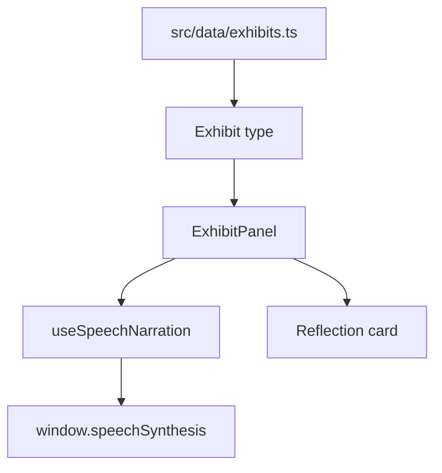

# Thuyết minh và khám phá hiện vật Implementation Plan

> **For agentic workers:** REQUIRED SUB-SKILL: Use superpowers:subagent-driven-development to implement this plan task-by-task. Steps use checkbox (`- [ ]`) syntax for tracking.

**Goal:** Làm giàu nội dung inspect cho toàn bộ hiện vật 3D, kết nối từng hiện vật với hành trình tìm đường cứu nước và các giá trị tư tưởng, đồng thời bổ sung chức năng đọc thuyết minh bằng giọng trình duyệt.

**Architecture:** Dữ liệu lịch sử sẽ nằm trong `src/data/exhibits.ts` qua các trường có cấu trúc (`historicalContext`, `keyIdea`, `reflectionQuestion`, `reflectionAnswer`, `audioText`) thay vì nhồi mọi thứ vào một đoạn văn. `ExhibitPanel` hiển thị các lớp nội dung theo thứ tự: nhận diện hiện vật, thuyết minh, mạch hành trình/tư tưởng, câu hỏi khám phá; một hook cục bộ dùng Web Speech API để phát/dừng tiếng Việt, không cần tải file âm thanh hay thêm dependency.

**Architecture Diagram:**

**Tech Stack:** React 19, TypeScript, Vite, Web Speech API (`SpeechSynthesisUtterance`).

## Global Constraints

- Không thêm dependency âm thanh bên ngoài; dùng giọng tiếng Việt có sẵn trên thiết bị.
- Không tự ý commit hoặc push.
- Giữ nguyên mô hình 3D, điều hướng và layout hiện tại; chỉ mở rộng dữ liệu và panel inspect.
- Nội dung lịch sử phải phân biệt diễn giải giáo dục với trích dẫn nguyên văn; không gán câu nói không có nguồn cho Chủ tịch Hồ Chí Minh.

### Task 1: Mở rộng mô hình dữ liệu hiện vật

**Files:**
- Modify: `src/types.ts`
- Modify: `src/data/exhibits.ts`

- [ ] **Step 1: Thêm các trường nội dung có cấu trúc**

Thêm vào `Exhibit`: `historicalContext`, `keyIdea`, `reflectionQuestion`, `reflectionAnswer`, `audioText`, đều là `string`. Mỗi trong 8 hiện vật phải có đủ 5 trường; nội dung nối được tuyến: rời Bến Nhà Rồng → quan sát thế giới và lao động → tiếp cận lý luận cách mạng → giành độc lập → xây dựng đời sống mới.

- [ ] **Step 2: Soạn nội dung tiếng Việt cho 8 hiện vật**

Mỗi hiện vật có một đoạn bối cảnh, một ý tư tưởng ngắn, một câu hỏi khám phá và đáp án mở rộng. Dùng các mốc được Bảo tàng Hồ Chí Minh công bố: 5/6/1911, tên Văn Ba, Đại hội Tours 12/1920, Bản Yêu sách 1919, trở về năm 1941 và Tuyên ngôn Độc lập 1945; tránh khẳng định nguồn gốc hiện vật ngoài thông tin đang có trong repo.

### Task 2: Bổ sung đọc thuyết minh

**Files:**
- Create: `src/hooks/useSpeechNarration.ts`
- Modify: `src/components/ExhibitPanel.tsx`

- [ ] **Step 1: Implement hook**

Tạo `useSpeechNarration(text: string)` trả về `{ isSupported, isSpeaking, toggle, stop }`. Hook dùng `speechSynthesis.cancel()` trước khi đọc, đặt `lang = 'vi-VN'`, `rate = 0.92`, `pitch = 1`, tự chuyển `isSpeaking` về `false` ở `onend`, `onerror`, và dọn speech khi unmount.

- [ ] **Step 2: Thêm khu vực “Nghe thuyết minh”**

Trong panel, dùng `audioText` làm nội dung đọc; hiển thị nút `▶ Nghe thuyết minh` / `⏸ Tạm dừng` và nút dừng khi trình duyệt hỗ trợ. Nếu không hỗ trợ, hiển thị hướng dẫn ngắn thay vì làm panel lỗi. Khi đóng panel, dừng giọng đọc.

### Task 3: Thiết kế lại nội dung inspect

**Files:**
- Modify: `src/components/ExhibitPanel.tsx`
- Modify: `src/styles.css`

- [ ] **Step 1: Render các lớp nội dung mới**

Hiển thị các block có nhãn rõ: `Bối cảnh lịch sử`, `Mạch hành trình`, `Gợi mở suy ngẫm`. Câu trả lời chỉ mở sau khi người dùng bấm “Xem gợi ý”, để biến inspect thành một hoạt động khám phá thay vì chỉ đọc văn bản.

- [ ] **Step 2: Thêm CSS responsive và trạng thái tương tác**

Tạo class thay vì tiếp tục dùng inline style cho các khu vực mới; bảo đảm text dài cuộn được, nút đọc có trạng thái đang phát, thẻ câu hỏi có tương phản tốt trên desktop và màn hình nhỏ.

### Task 4: Kiểm chứng nội dung và build

**Files:**
- Verify: `src/types.ts`, `src/data/exhibits.ts`, `src/components/ExhibitPanel.tsx`, `src/hooks/useSpeechNarration.ts`, `src/styles.css`

- [ ] **Step 1: Kiểm tra type/build**

Chạy `npm run build`; expected: TypeScript và Vite build PASS.

- [ ] **Step 2: Kiểm tra thủ công**

Mở panel từng hiện vật, xác nhận đủ bối cảnh/ý tưởng/câu hỏi, bấm nghe–dừng–đóng panel, kiểm tra ESC không để giọng đọc tiếp tục; kiểm tra cả hiện vật tài liệu và hiện vật mô hình.

## Self-review

- Spec coverage: nội dung chi tiết, câu hỏi khám phá, kết nối hành trình cứu nước/tư tưởng, và giọng đọc nằm ở Tasks 1–3; build và kiểm tra hành vi nằm ở Task 4.
- No placeholders: kế hoạch nêu rõ tên trường, hook, giá trị speech và các nhãn UI cần tạo.
- Type consistency: `ExhibitPanel` chỉ đọc các trường bắt buộc đã khai báo trong `Exhibit`; hook nhận đúng `audioText: string`.
