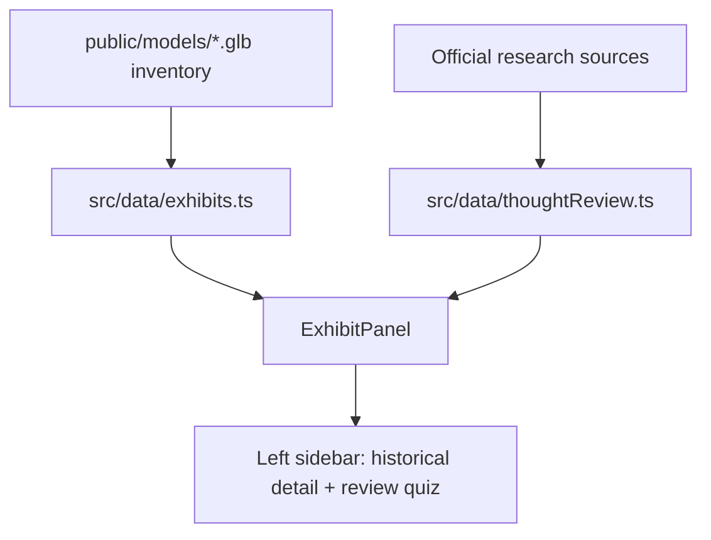

# Museum Model Data and Thought Review Quiz Implementation Plan

> **For agentic workers:** REQUIRED SUB-SKILL: Use superpowers:subagent-driven-development to implement this plan task-by-task. Steps use checkbox (`- [ ]`) syntax for tracking.

**Goal:** Ensure every usable 3D model is represented without duplicate assets and add a complete, source-informed Hồ Chí Minh thought review quiz to the left exhibit panel.

**Architecture:** Keep exhibit-specific historical data in `src/data/exhibits.ts`, add a shared review-question dataset in `src/data/thoughtReview.ts`, and render the shared quiz from `ExhibitPanel` for every selected exhibit. Duplicate GLB files remain unregistered so the scene does not show repeated geometry.

**Architecture Diagram:**

**Tech Stack:** React, TypeScript, Vite, existing `DiscoveryStep` UI, static local exhibit data.

## Global Constraints

- Do not add duplicate exhibit entries for files with identical SHA-256 content.
- Keep all new historical claims grounded in official Bảo tàng Hồ Chí Minh or hochiminh.vn sources.
- Do not add dependencies, commit, or push.
- Preserve existing movement, inspect, and audio behavior.

### Task 1: Add shared thought-review content

**Files:**
- Create: `src/data/thoughtReview.ts`
- Modify: `src/types.ts` only if a reusable source-link type is needed (not required for the first implementation)

- [ ] **Step 1: Add five multiple-choice review questions** covering independence/freedom and human happiness, đại đoàn kết, Nhà nước của dân/do dân/vì dân, cần-kiệm-liêm-chính/chí công vô tư, and học đi đôi với hành. Each item must use the existing `DiscoveryStep` shape and include an explanation.
- [ ] **Step 2: Add a short source note in the module comment** pointing to the official Bảo tàng Hồ Chí Minh and hochiminh.vn articles used to formulate the questions.

### Task 2: Render the review quiz in the left sidebar

**Files:**
- Modify: `src/components/ExhibitPanel.tsx`
- Modify: `src/styles.css`

- [ ] **Step 1: Import the shared question list and add independent local answer state** so answering questions for one exhibit does not mutate exhibit data.
- [ ] **Step 2: Render a new `ÔN TẬP TƯ TƯỞNG HỒ CHÍ MINH` section after the exhibit-specific discovery section**, reusing the existing option/feedback interaction pattern.
- [ ] **Step 3: Add compact visual styles** that distinguish the shared review section from the artifact discovery section while keeping the existing sidebar scroll behavior.

### Task 3: Validate model coverage and build

**Files:**
- Modify: `docs/superpowers/plans/2026-10-08-model-data-review-quiz.md` to record validation notes only if needed.

- [ ] **Step 1: Verify every unique usable exhibit GLB is referenced by an exhibit and document the three identical duplicate files.**
- [ ] **Step 2: Run `npm run build` and confirm TypeScript/Vite success.**
- [ ] **Step 3: Run `git diff --check` and `git status --short`; do not commit or push.**

## Sources used

- [Bảo tàng Hồ Chí Minh — Về học và làm theo Bác](https://baotanghochiminh.vn/ve-hoc-va-lam-theo-bac.htm)
- [Bảo tàng Hồ Chí Minh — Tư tưởng Hồ Chí Minh về xây dựng nhà nước vì dân](https://baotanghochiminh.vn/tu-tuong-ho-chi-minh-ve-xay-dung-nha-nuoc-vi-dan-trong-nghi-quyet-dai-hoi-xiii-cua-dang.htm)
- [hochiminh.vn — Tư tưởng Hồ Chí Minh về đại đoàn kết](https://hochiminh.vn/tu-tuong-dao-duc-ho-chi-minh/noi-dung-tu-tuong-dao-duc/tu-tuong-ho-chi-minh-ve-dai-doan-ket-25)
- [hochiminh.vn — Tư tưởng Hồ Chí Minh về đạo đức](https://hochiminh.vn/tu-tuong-dao-duc-ho-chi-minh/noi-dung-tu-tuong-dao-duc/tu-tuong-ho-chi-minh-ve-dao-duc-27)
